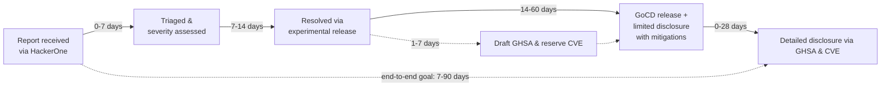

# Security Policy

## Contents

- [Reporting a Vulnerability](#reporting-a-vulnerability)
- [Supported Versions](#supported-versions)
- [Baseline](#baseline)
- [Disclosure Policy](#disclosure-policy)
- [Vulnerabilities FAQ](#vulnerabilities-faq)
- [Threat model](#threat-model)

## Reporting a Vulnerability

Please report any issues to https://hackerone.com/gocd according to the listed policy.

## Supported Versions

The GoCD community only actively maintains and fixes security issues on top of the most recent released version.

Since breaking changes are rare, and generally sign-posted well in advance, we encourage users to stay on a recent or current version to allow for upgrade as easily as possible in the event of a security defect.

Having said this, wherever possible we will try and provide suggested mitigations or workarounds for older versions.

## Baseline

This represents the oldest versions which have **no known exploitable vulnerabilities** of a given severity, as assessed by GoCD maintainers and/or NIST NVD via CVSS 4.0 or 3.1. Users are strongly recommended to be on at least these versions; and preferably the latest version. 

| Without known vulns               | Version                                              |
|-----------------------------------|------------------------------------------------------|
| No >= **critical** severity vulns | >= [`24.5.0`](https://www.gocd.org/releases/#24-5-0) |
| No >= **high** severity vulns     | >= [`26.1.0`](https://www.gocd.org/releases/#26-1-0) |
| No >= **medium** severity vulns   | >= [`26.1.0`](https://www.gocd.org/releases/#26-1-0) |
| No known vulns of any severity    | >= [`26.1.0`](https://www.gocd.org/releases/#26-1-0) |

Please note that this does *not* mean that there are zero potential vulnerabilities known from GoCD's dependencies
in this or subsequent versions. However where such vulnerabilities exist, none have been confirmed to be exploitable via GoCD
itself (without a prior non-GoCD breach).

## Disclosure Policy

GoCD does not have a formal disclosure policy for vulnerability details, however generally our practice has been

| Severity                     | During fix/patch development     | Upon fix/patched release             | Detailed disclosure / published CVE         |
|------------------------------|----------------------------------|--------------------------------------|---------------------------------------------|
| >= **high** severity vulns   | Limited _(*)_ or zero disclosure | Limited disclosure with mitigations. | 2-4 weeks after patched version's release.  |
| <= **medium** severity vulns | Limited _(*)_ disclosure         | More detailed disclosure             | Immediately upon patched version's release. |

_(*)_ - As an open-source project for ease of collaboration fixes _may_ be developed in the open (with somewhat obfuscated PR or commit comments) rather than entirely developed in private.

At a high level, a report typically flows through the following lifecycle:

## Threat model

See **[Threat Model](SECURITY_THREAT_MODEL.md)** for baseline assumptions about deployments, user privileges, the authorization role hierarchy, and the sensitivity of various entities.

It is intended to help both human reviewers and automated tooling reason about the impact and severity of
potential issues, and is a guide to GoCD's _intended_ design rather than a guarantee; deviations from the
behaviour described there may themselves be security issues and should be reported.

## Vulnerabilities FAQ

### How do I know if I am using a release with known vulnerabilities?

In more recent years, an effort has been made to publish and request CVEs for responsibly disclosed & fixed issues to increase transparency and help users assess risk of running older versions.

While many are available as [GitHub Security Advisories](https://github.com/gocd/gocd/security/advisories), you can generally use the [NIST NVD database query tools](https://nvd.nist.gov/vuln/search#/nvd/home?cpeFilterMode=cpe&cpeName=cpe:2.3:a:thoughtworks:gocd:22.3.0:*:*:*:*:*:*:*&resultType=records) to search for those affecting your specific version by replacing the version `22.3.0` with your own  and clicking "_Search_".

Note that this unlikely to be a complete listing of _all_ reported, responsibly disclosed and fixed issues. If there is a _publicly disclosed_ historical issue that is missing, please [raise an issue](https://github.com/gocd/gocd/issues/new) to let us know, and we will endeavour to document it properly.

### What about potential vulnerabilities from transitive dependencies?

The GoCD team make a concerted effort to keep dependencies up-to-date wherever possible, however GoCD does
still have some EOL dependencies with known vulnerabilities that GoCD is not vulnerable to, but which may create noise in scanner reports.

While this is a moving target the GoCD team maintain documented suppressions with commentary via:
- [OWASP Dependency Check suppression commentary](https://github.com/gocd/gocd/blob/master/build-platform/dependency-check-suppress.xml) - Java, JavaScript & Ruby/JRuby dependencies use [ODC](https://owasp.org/www-project-dependency-check/)
  - build.gocd.org [report](https://build.gocd.org/go/files/Security-Checks/latest/Security-Checks/latest/dependency-check/dependency-check-report.html) (use _Guest_ login)
- [Trivy suppression commentary](https://github.com/gocd/gocd/blob/master/build-platform/.trivyignore.yaml) - built container images (OS and packaged dependencies), especially server use [Trivy](https://trivy.dev/) 
  - build.gocd.org [Security-Checks-Containers](https://build.gocd.org/) pipeline run (use _Guest_ login)
