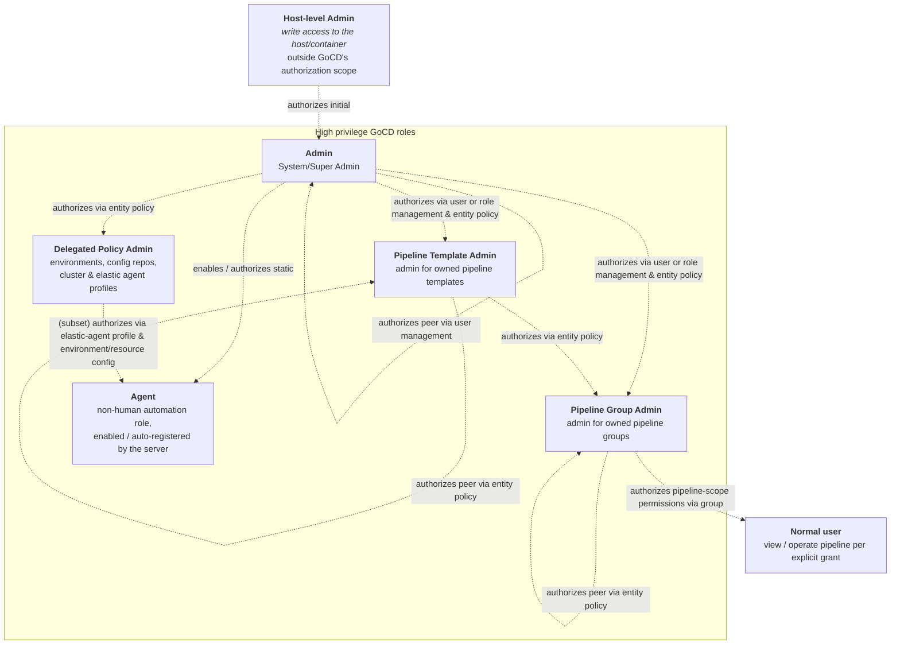

# Threat Model

> Part of GoCD's [Security Policy](SECURITY.md).

This document summarises some baseline assumptions about GoCD's threat model, particularly around user
privileges and what is (and is not) considered "high privilege". It is intended to help both human reviewers
and automated tooling reason about the impact and severity of potential issues. It is a guide to GoCD's
_intended_ design, not a guarantee; deviations from the behaviour described here may themselves be security issues.

## Contents

- [Deployment](#deployment)
- [Authentication](#authentication)
- [Authorization](#authorization)
  - [Host-level Admin](#host-level-admin)
  - [Admin (a.k.a. System/Super Admin)](#admin-aka-systemsuper-admin)
  - [Delegated Policy Admin](#delegated-policy-admin)
  - [Pipeline Group Admin (a.k.a. Group Admin)](#pipeline-group-admin-aka-group-admin)
  - [Pipeline Template Admin (a.k.a. Template Admin)](#pipeline-template-admin-aka-template-admin)
  - [Agent](#agent)
  - ["Normal" user](#normal-user)
  - [Anonymous user](#anonymous-user)
- [Entities and data sensitivity](#entities-and-data-sensitivity)
  - [Server Config XML](#server-config-xml)
  - [Credentials & Secure Variables](#credentials--secure-variables)
  - [Artifacts](#artifacts)
  - [Configuration Repositories (a.k.a. Config Repos, Pipelines-as-Code)](#configuration-repositories-aka-config-repos-pipelines-as-code)
  - [Environments](#environments)
  - [Resources](#resources)
  - [Agents](#agents)
  - [Cluster Profiles & Elastic Agent Profiles](#cluster-profiles--elastic-agent-profiles)
  - [Secret Configurations (Secrets Management)](#secret-configurations-secrets-management)
  - [Pipeline Templates](#pipeline-templates)
  - [Materials](#materials)
  - [Pipeline Groups / Pipelines / Stages / Jobs / Tasks](#pipeline-groups--pipelines--stages--jobs--tasks)

## Deployment

GoCD makes some baseline assumptions about how the server and its agents are deployed and exposed to a network.
These assumptions inform the severity of network-exposure and transport-security issues - GoCD relies on the
surrounding infrastructure for several controls it does not implement itself.

- **TLS termination is the deployer's responsibility.** Deployments are expected to front the GoCD server
  (and agent traffic) with a [TLS-terminating reverse proxy](https://docs.gocd.org/current/installation/configure-reverse-proxy.html)
  (e.g. nginx, Apache `httpd`, or a load balancer) and/or a Web Application Firewall (WAF). GoCD does not itself
  provide WAF-style request filtering, request-size limiting, rate limiting, or DDoS protection; these are considered
  the responsibility of the surrounding infrastructure.
- **The server is not assumed to be nakedly exposed to the public internet.** Internet-reachable deployments are
  assumed to restrict access to a trusted network - via a VPN, or a mesh-VPN / zero-trust access
  service such as [Tailscale](https://tailscale.com/),
  [Cloudflare WARP / Tunnel](https://www.cloudflare.com/products/tunnel/), or similar. GoCD's own
  authentication and authorization are intended to be the primary access control, but network-level restriction is
  assumed as defence-in-depth, particularly for administrative, API, and agent-facing endpoints.
- **Agents execute arbitrary code by design, and should be isolated.** Building or deploying inherently means running
  arbitrary code, so any user who can configure a pipeline can cause code to run on any agent matching that pipeline's
  resources and environment. Agents are therefore a key trust boundary: they _should_ be run separately from the GoCD
  server host, network-segmented away from sensitive or production systems, and given only the credentials necessary
  for the work they are approved to execute. Lower-trust environments are encouraged to prefer
  [ephemeral / elastic agents](https://docs.gocd.org/current/configuration/elastic_agents.html) that are destroyed
  after use, and to scope credentials per environment/resource rather than sharing them broadly.
- **Backups contain the server's encryption key.** A GoCD backup bundles the server's secret encryption key alongside the
  configuration it protects, so a single backup is sufficient to decrypt every stored secret inside the GoCD Server Config XML. Backups must therefore
  be treated as **highly sensitive** - encrypted at rest, access-restricted, and ideally retained separately from the
  systems and credentials they could be used to compromise. Using external
  [Secrets Management](https://docs.gocd.org/current/configuration/secrets_management.html) integrations mitigates this 
  risk by moving secrets outside GoCD's config; providing that credentials to access the external secret store are also
  persisted outside GoCD's configuration (e.g provided by environment or ephemeral mount - varies by plugin implementation).
- **The database is inside the trust boundary.** GoCD's database (the bundled H2, or an external PostgreSQL/MySQL)
  holds pipeline history, commit history & hashed+salted user access tokens which should be considered sensitive. It should not be exposed to untrusted networks; external databases should use TLS and least-privilege credentials, and be treated with
  the same sensitivity as the GoCD server itself.
- **Secrets at rest rely on host filesystem protections.** The server encryption key, and file-based secrets
  are protected only by the file-system permissions of the host's volume mount (see [Host-level Admin](#host-level-admin)).
  Deployments are expected to apply appropriate file permissions and, where warranted, disk/volume encryption to the
  `config` and `data` directories.

## Authentication

- It is assumed that [security is enabled](https://docs.gocd.org/current/configuration/dev_authentication.html)
  on the GoCD server, and that an [authorization plugin](https://www.gocd.org/plugins/) is configured. Most of the
  authorization model below is meaningless on a server running without security enabled.
- Multi-factor authentication and/or restrictions on login attempts (rate limiting, lockout, etc.) are considered
  the responsibility of the authorization plugin (or upstream identity provider), and **not** the responsibility of
  the GoCD server itself.
- Unlikely users, agents are either "approved" for use, or authenticated using a shared secret (an agent auto-registration key).
- GoCD supports access tokens for API access (conditional on support within a specific authorization plugin), which are
  considered equivalent to a user login session. Tokens should be treated as sensitive secrets. Deployments in lower-trust
  environments may wish to disable this functionality or specific rate limit access to APIs.

## Authorization

GoCD recognises several broad classes of role, listed below in roughly decreasing order of privilege.

### Host-level Admin

Host-level Admin is **not understood by GoCD** itself. In this threat model it refers to anyone with write access to the
host or container that GoCD runs on.

- It is generally assumed by GoCD to be a subset of those known to GoCD as "Admin" (see below), but is conceptually distinct.
- This role can make certain configuration changes that are deliberately **not** possible through the GoCD UI, such as:
  - regenerating or changing the encryption key;
  - deleting or modifying file-based secrets storage;
  - deleting or modifying artifacts on disk.
- Authorization for this role is assumed to be handled by the operator at the host level. GoCD's scope is limited to
  ensuring sensitive files are written with appropriate file-system permissions.

### Admin (a.k.a. System/Super Admin)

System Admin is the **highest-privileged role managed by GoCD**. These users can operate or edit any pipeline and change
server-wide configuration. They can appoint other administrators, delegate group-admin permissions, import new
users from an external source, and otherwise perform destructive operations against the GoCD server.

- Admin permissions generally should **not** allow or facilitate arbitrary changes to the host GoCD runs on,
  especially outside GoCD's own data-storage directories and working areas.
- In practice, GoCD admins are often also users who have access to the environment hosting GoCD, but this is an
  operational reality rather than something GoCD's design assumes or requires.

### Delegated Policy Admin

GoCD allows certain System Admin functions to be delegated at a fine-grained level to other users and roles, via
[policy-based access control](https://docs.gocd.org/current/configuration/policy_in_gocd.html). The supported entity
types are **environments**, **configuration repositories**, **cluster profiles** and **elastic agent profiles**,
with `view` and `administer` actions.

- Such permissions should never, by themselves, grant pipeline-scope permissions. However, they may by design change
  the way pipelines run, and because the affected entities are frequently shared across many pipeline groups, this is
  considered a **high privilege** role.

### Pipeline Group Admin (a.k.a. Group Admin)

Pipeline Group Admin is also a **high privilege** role, because GoCD's pro-collaboration "value stream" design intentionally allows
certain entities to be shared between different pipeline groups.

- A Pipeline Group is the core unit of runtime permissions for GoCD, and the default visualisation grouping on dashboards.
- The intended scope of impact is generally a team, or a group of teams within an organisation.
- These users can operate or edit any pipeline within the pipeline groups they administer. They can also edit certain
  shared configuration (source-control materials) already consumed by groups they administer, and - to
  facilitate configuring new pipelines - can create and edit some "server-wide" configuration, namely
  [**Package Repositories**](https://docs.gocd.org/current/configuration/delegating_group_administration.html) and
  package definitions. Because these can be shared with pipeline groups the user does **not** administer, these actions
  can be considered high privilege.
- They can also view any existing pipeline templates across the server instance.
- Deployments in lower-trust environments are advised to minimise use of this role, instead preferring
  [Configuration Repositories ("Pipelines as Code")](https://docs.gocd.org/current/advanced_usage/pipelines_as_code.html)
  to let users edit pipeline configuration. This allows source-control repository permissions and review workflows to
  constrain who can view or edit pipeline configuration, independently of GoCD's own model.
- Over time, GoCD sought to reduce the implicit permissions of Group Admins through introduction of Delegated Policy,
  however this transition is incomplete. 

### Pipeline Template Admin (a.k.a. Template Admin)

Pipeline Template Admin is **moderately-high privilege** role, since a template can be used by many pipelines across
different groups.

- A Pipeline Template has specific admins defined within its configuration. Usually these are pipeline group admins
  however the role can be assigned to anyone.
- Since editing a template can affect many pipelines across different groups, this is considered a moderately-high privilege role.

### Agent

An agent holds a special, non-human role that can perform actions no other role can - such as uploading artifacts
(including logs) and changing the status of build jobs.

- Agents are authorized only after being explicitly "enabled" by a user, or after authenticating with an agent
  [auto-registration key](https://docs.gocd.org/current/advanced_usage/agent_auto_register.html) configured on the
  server and distributed to the agent at startup.
- Agents should not be able to alter any server or pipeline configuration, nor artifacts or the status of builds/jobs other than those the server has allocated
  to them.
- Agents should not be sent data, "work" or credentials beyond what is strictly necessary for executing a job the
  server has allocated to them. That work should only contain metadata as appropriate for the environments and/or
  resources that agent is approved and registered to execute.
- Agent APIs should be inaccessible for access by any regular other user type.

### "Normal" user

This is any user with permission to log in to GoCD, with access to view or operate a subset of pipelines.

- Via the GoCD UI, this can be assumed to be any user who has a role or direct user mapping to _View_ or _Operate_ 1+ 
  pipeline groups, or with a delegated policy role (see above). Users can be considered a "normal" user within the context
  of one pipeline group, but a Group Admin within another. 
- By default, a new "Normal" user should have **no** permission to view any pipelines, pipeline details, or anything beyond basic
  server information, unless explicitly granted by a higher-privileged role.
- Over time such users may become Pipeline Group Admins or Delegated Policy Admins if their permissions are changed through
  addition of a role, or a direct permission.
- Within this category, users may hold different classes of permission - for example those who can _operate_ pipelines
  (trigger, pause, cancel) versus those who can only _view_ them.
- Individual pipeline stages can further restrict who may operate them, narrowing what the owning pipeline group can do 
  - for example to support gating certain manual pipeline for approval by specific users.

### Anonymous user

This is any user who is not logged in (pre-login).

- Such users should only be able to view the login screen and static assets. GoCD's static assets / HTML / CSS /
  JavaScript, and agent/plugin bundle are **not** considered sensitive.

## Entities and data sensitivity

### Server Config XML

- The GoCD server configuration XML is considered highly sensitive and should only be viewable or editable by System Admins.
- Retrieval and editing of this XML is available via API and UI for historical reasons, but is highly discouraged.

### Credentials & Secure Variables

- Credentials within GoCD configuration are considered the most sensitive data GoCD has to protect and should never be returned to the user interface or via API as plain-text, *except* when being returned as part of work to agent jobs.
- For historical reasons, encrypted variants of credentials are not considered sensitive, and are returned by certain APIs. GoCD should make an effort to not return these via APIs except where required to support API or UI administration of the configuration.
- All values are encrypted using (`AES/CBC/PKCS5Padding`) using a 128-bit IV and the server's 128-bit AES key, which is
  stored as a file on the server host.

### Artifacts

- Artifacts (including build console logs) are considered somewhat sensitive, and should only be viewable by users with 
  view access to the pipeline group that produced them. Artifacts are not considered sensitive to approved agents that 
  have been allocated work by the server.
- Group Admins can configure a pipeline to fetch an artifact from a pipeline in another group for which they do not have
  access to. They cannot directly download the artifact itself, nor publish/modify it.
- Artifacts are assumed to not contain sensitive information such as credentials.

### Configuration Repositories (a.k.a. Config Repos, Pipelines-as-Code)

- Configuration Repositories are policy-controlled entities that can be viewed or edited only by those users with 
  delegated policy permissions to do so.

### Environments

- Environments are policy-controlled entities that can be viewed or edited only by those users with
  delegated policy permissions to do so.
- **Names** of environments are not considered sensitive, though GoCD makes best efforts to hide their existence from users
  without appropriate policy defined.

### Resources

- Resources represent only tags for matching to agents, and are not considered sensitive.

### Agents

- The list of agents registered on the server is not considered sensitive.
- Only system admins should be able to interact with agents directly (e.g. disabling them, summarily killing
  jobs/tasks). Regular users can only act on agents indirectly, through a pipeline or stage context and subject to
  their "operate" permissions, with the GoCD server mediating any resulting action on the relevant agents.

### Cluster Profiles & Elastic Agent Profiles

- Define how and where elastic agents are provisioned, and frequently hold **secrets** (cloud, Kubernetes, or
  Docker-registry credentials) encrypted with the server key.
- Policy-controlled entities: viewable/editable by System Admins and any user holding a matching `cluster_profile`
  or `elastic_agent_profile` policy (a [Delegated Policy Admin](#delegated-policy-admin)). Because a profile dictates
  what infrastructure runs build code, administering one is a high-privilege, Remote Code Execution-adjacent capability.

### Secret Configurations (Secrets Management)

- Connect GoCD to an external secret store, and may hold the **encrypted credentials** used to authenticate to it.
- **System Admin only** to create or edit. The rules within a secret configuration separately govern which
  pipelines, pipeline groups, or environments may *resolve* secrets through it.

### Pipeline Templates

- Since pipeline templates can be consumed by pipelines in different groups, they are visible to all Group Admins.
- Only configured Template Admins can edit the content of a pipeline template.

### Materials

- Materials are a first-class, shared citizen in GoCD: the same material (by identity, e.g. URL) can be consumed by
  many pipelines across different groups, and GoCD intentionally correlates them to support
  [fan-in](https://docs.gocd.org/current/advanced_usage/fan_in.html) material resolution (ensuring downstream
  pipelines build off a consistent upstream version). As a consequence, the existence and identity of a material may
  be visible beyond a single pipeline group, and is not treated as group-private.
- The **URL** of a material is not considered sensitive. For historical reasons, GoCD does not consider the **username** of a material's credential to be sensitive - only its password/token.
- Deployments in lower-trust environments should use [secrets management](https://docs.gocd.org/current/configuration/secrets_management.html) for material credentials,
  or authenticate outside GoCD entirely (e.g. Git SSH keys, cloud-provider authorization systems).

### Pipeline Groups / Pipelines / Stages / Jobs / Tasks

- A pipeline / stage / job / artifact **name/id** is not considered sensitive to users who lack access to its pipeline group. GoCD
  makes best efforts to hide irrelevant pipelines, stages and jobs from users with no need to see them, but some
  visibility is often required to facilitate collaboration (e.g. a pipeline that depends on a pipeline in another group
  the user cannot otherwise access).
- Generally speaking, GoCD prioritizes collaboration between pipelines in different groups above strict "tenant-style"
  isolation, and since names represent globally unique identifiers are not considered sensitive. As such, sensitive
  information can be assumed to not be present in such names.
- The specific task steps, environment variables, parameters and build/job run logs **are** considered more sensitive:
  viewable only to users with view access to that pipeline group, and credentials known to GoCD should always be
  redacted at source.
